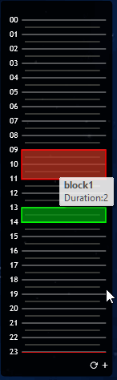

# Rainmeter-blockout

Every needed a quick and easy method of blocking out your day?

This is you solution!

## Usage

Add a block by clicking the plus button in the following format

`blockName,hour,duration`

For example, adding `emails,9,3` will add a block that starts at 9 o'clock for 3 hours.

Mouseover a block for the name

Double Click on the center of a block to remove it.

## Download

Download the Skin Installer from releases.

## Contribute

Is you have issue or suggestions please submit an issue. PRs will be reviewed if suitable.

## Credits

The inspiration for this skin and an example for how to create and delete Meters dynamically comes from [alperenozlu/rainmeter-todo](https://github.com/alperenozlu/rainmeter-todo)
Lua JSON functions are from [rxi/json.lua](https://github.com/rxi/json.lua)
